# Dependency tree

# Refuel (Move from Scaladia 3.0.0)

Refuel is a simple and lightweight DI framework 
Provides DI, utility, JSON parser, HTTPClient, etc. suitable for layered architecture. 
You can replace second or third party injections from anywhere and easily handle multi-project configuration dependencies.

## [refuel-container](https://github.com/giiita/refuel/tree/master/refuel-container)

> DI container provides powerful injection with macro. 
> Just by Mixining a specific trait, it will be loaded automatically into DI container. 
> It is also possible to easily change dependencies from test cases or allow access only from arbitrary scopes. 

## [refuel-util](https://github.com/giiita/refuel/tree/master/refuel-util)

> Rich type class interfaces. 
> Provides extended functions such as date and time, period, and collection.

## [refuel-json](https://github.com/giiita/refuel/tree/master/refuel-json)

> You can handle JSON most easily with macro.
> Even without warming up, the conversion works fast and requires little declaration of serialize / deserialize codecs.

## [refuel-http](https://github.com/giiita/refuel/tree/master/refuel-http)

> Http server client with Akka-HTTP. 
> In future, we plan to implement test stub control by dependency injection.. 

## refuel-test

> In preparation.

## refuel-cipher

> In preparation.
